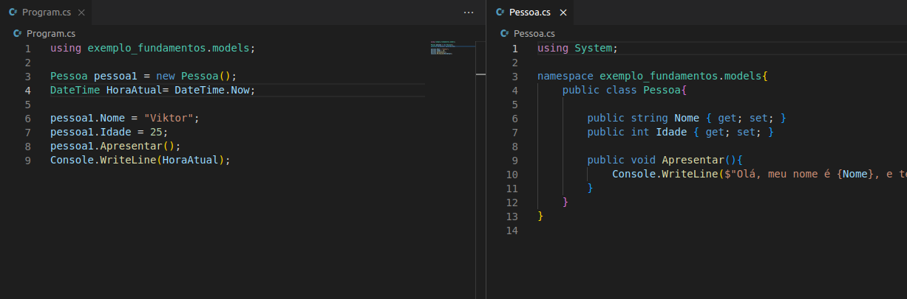

# C# Primeiras Linhas
<h2>Começando a programação com C#</h2>

<h2>Código</h2>

Codigo feito na aula de "Sintaxe e Tipos de Dados em C#" da DIO.

<h2>Tecnologias</h2>

- C# 

- GIT e GitHub 

<h2>Contato</h2>

viktorariel777@gmail.com

